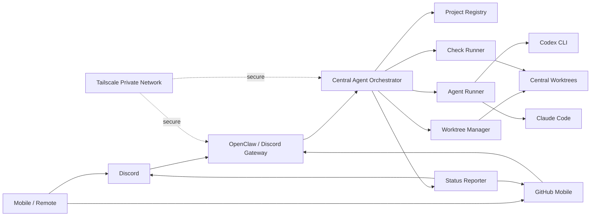
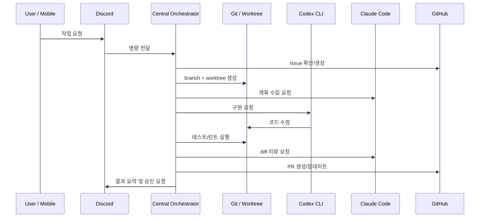

# 로컬 멀티에이전트 협업 환경 구축 설계서

## 1. 핵심 방향

**오케스트레이터는 각 프로젝트에 심지 않는다.**  
로컬 머신에 하나의 중앙 실행 프로그램으로 설치하고, 여러 프로젝트를 설정으로 등록해서 사용한다.

```text
중앙 워커 1개
  → 여러 로컬 프로젝트 제어
  → 프로젝트별 worktree 생성
  → Codex / Claude Code 실행
  → Discord / GitHub에 결과 보고
```

---

## 2. 목표

- 원격·모바일에서 로컬 프로젝트 작업 지시
- 로컬에 설치된 Codex CLI / Claude Code 그대로 사용
- Discord는 명령·알림·승인 UI로 사용
- GitHub Issue / PR은 작업 원장으로 사용
- 작업별 branch / worktree로 충돌 방지
- 각 프로젝트에는 최소 파일만 추가

---

## 3. 전체 아키텍처



---

## 4. 실행 구조

```text
~/agent-workstation/
  중앙 오케스트레이터
  프로젝트 설정
  작업 큐
  로그
  worktree 저장소

~/projects/
  my-app/
  my-api/
  my-bot/

~/agent-workstation/worktrees/
  my-app-task-101/
  my-api-task-32/
  my-bot-task-7/
```

핵심:

```text
각 프로젝트에 설치 X
중앙 워커에 프로젝트 등록 O
```

---

## 5. 권장 폴더 구조

### 중앙 워커 레포

```text
agent-workstation/
├── apps/
│   ├── orchestrator/
│   └── discord-gateway/
├── scripts/
│   ├── create_worktree.sh
│   ├── run_agent.sh
│   ├── run_checks.sh
│   └── cleanup_worktree.sh
├── configs/
│   ├── projects.yaml
│   ├── agents.yaml
│   └── discord.yaml
├── templates/
│   ├── pr_template.md
│   └── task_summary.md
├── docs/
│   └── architecture.md
├── logs/
├── worktrees/
├── README.md
└── docker-compose.yml
```

### 실제 프로젝트

```text
my-app/
├── src/
├── package.json
├── README.md
└── AGENTS.md        # 선택, 권장
```

프로젝트에 추가하는 것은 원칙적으로 `AGENTS.md` 정도만 둔다.

---

## 6. 프로젝트 등록 방식

중앙 워커의 `configs/projects.yaml`에 프로젝트를 등록한다.

```yaml
projects:
  my-app:
    path: /Users/me/projects/my-app
    default_branch: main
    package_manager: npm
    commands:
      test: npm test
      lint: npm run lint
      typecheck: npm run typecheck

  my-api:
    path: /Users/me/projects/my-api
    default_branch: main
    package_manager: uv
    commands:
      test: pytest
      lint: ruff check .
      typecheck: mypy .
```

Discord 명령 예시:

```text
/run my-app 로그인 실패 메시지 개선
/review my-api PR #42 리뷰
/status
```

---

## 7. 작업 흐름



---

## 8. 작업 단위 원칙

```text
한 작업 = 한 Issue = 한 Branch = 한 Worktree = 한 PR
```

### 같은 작업

```text
Claude 계획
→ Codex 구현
→ Claude 리뷰
→ Codex 수정
```

같은 branch / worktree를 순차적으로 사용한다.

### 다른 작업

```text
Task A → worktree A
Task B → worktree B
Task C → worktree C
```

서로 다른 branch / worktree에서 병렬 처리한다.

---

## 9. 에이전트 역할

| 역할 | 담당 |
|---|---|
| Claude Code | 계획, 설계 검토, diff 리뷰, 리스크 점검 |
| Codex CLI | 구현, 수정, 테스트 실패 반영 |
| Orchestrator | 작업 라우팅, worktree 생성, 명령 실행, 상태 보고 |
| Human | 승인, merge, 위험 작업 판단 |

---

## 10. 최소 구현 모듈

| 모듈 | 기능 |
|---|---|
| Project Registry | 등록된 프로젝트 목록 관리 |
| Command Handler | Discord 명령 파싱 |
| Worktree Manager | branch / worktree 생성 |
| Agent Runner | Codex / Claude Code 실행 |
| Check Runner | test / lint / typecheck 실행 |
| Reporter | Discord / GitHub에 결과 보고 |
| Approval Gate | 위험 작업 승인 처리 |

---

## 11. 보안 원칙

- private Discord 서버 사용
- Discord / GitHub 접근 allowlist 적용
- Tailscale 기반 원격 접속
- 토큰·시크릿은 중앙 워커의 환경변수로 관리
- 프로젝트 `.env`, key, secret 파일 접근 제한
- `main` 직접 수정 금지
- merge / deploy / migration은 사람 승인 필요

---

## 12. 품질 게이트

PR 전 필수 체크:

```text
formatter
linter
typecheck
test
Claude Code review
human approval
```

프로젝트 통일성은 에이전트 취향이 아니라 아래로 강제한다.

```text
AGENTS.md
formatter
linter
test
PR template
review
```

---

## 13. AGENTS.md 최소 예시

```md
# AGENTS.md

## 규칙

- 기존 코드 스타일과 폴더 구조를 따른다.
- main 브랜치에서 직접 작업하지 않는다.
- 새 라이브러리는 승인 없이 추가하지 않는다.
- 큰 리팩터링은 별도 승인 후 진행한다.
- 테스트 없는 기능 변경은 피한다.
- formatter / linter / test를 실행한다.
- .env, token, key, secret 파일은 읽거나 수정하지 않는다.

## 역할

- Codex: 구현과 테스트 수정
- Claude Code: 계획, 리뷰, 리스크 점검
```

---

## 14. 배포 방식

초기:

```text
로컬 터미널에서 실행
```

운영:

```text
systemd 또는 docker-compose로 중앙 워커 상시 실행
```

예시:

```text
agent-workstation up
agent-workstation status
agent-workstation stop
```

---

## 15. 구축 단계

### Phase 1. MVP

- 중앙 워커 레포 생성
- 프로젝트 1개 등록
- Discord 명령 연결
- Codex / Claude Code 실행 테스트
- 수동 PR 생성

### Phase 2. 운영형

- Issue → branch/worktree 자동 생성
- 테스트/린트 자동 실행
- 결과 요약 자동 보고
- PR 생성 자동화

### Phase 3. 확장형

- 작업 큐
- 재시도 로직
- 프로젝트별 설정
- 대시보드
- 배포 승인 게이트

---

## 16. 결론

가장 중요한 설계 원칙:

```text
오케스트레이터는 중앙에 하나만 둔다.
실제 프로젝트에는 거의 아무것도 심지 않는다.
프로젝트는 설정으로 등록한다.
작업은 worktree로 격리한다.
소통은 Discord/GitHub로 한다.
실행은 로컬에서 한다.
품질은 Git/테스트/리뷰로 강제한다.
```

추천 시작점:

```text
하나의 private Discord 서버
하나의 중앙 agent-workstation 레포
하나의 등록된 프로젝트
하나의 Codex 실행 흐름
하나의 Claude 리뷰 흐름
```
